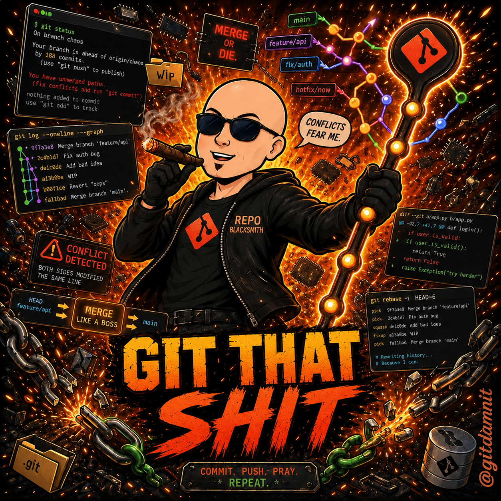

# OpenCode Git That Shit



> "Oh Shit Git" is what you say after the disaster. Git That Shit is what the tool does *before* the disaster.

Automatic pre-disaster snapshots for OpenCode AI coding agent config and state files.

## What is Git That Shit?

Git That Shit is a safety plugin for OpenCode AI coding agent sessions. It automatically snapshots fragile configuration and agent state files into a separate shadow git repository before risky operations.

The product exists because one malformed JSON edit, one extra whitespace-sensitive config mistake, one bad agent command, or one accidental overwrite can break an entire coding environment. Git That Shit makes those failures recoverable.

## Why it exists

AI coding agents (OpenCode, Claude Code, Aider, Codex) operate with elevated privileges over project files. Unlike human developers who hesitate before destructive acts, agents execute commands confidently — and sometimes catastrophically.

**Why project git is not enough:**
- Git is not always present
- Config files are often in `.gitignore` or untracked
- Git records changes *after* they happen, not *before*
- Most users don't commit before every risky operation

Git That Shit is inspired by **etckeeper** — the Linux tool that automatically commits `/etc` to git before package manager operations.

## What it protects

By default, Git That Shit tracks:
- `opencode.json` - OpenCode main config
- `.opencode/state/checkpoint.json` - Session state
- `.opencode/state/handoff.md` - Handoff document
- `.opencode/state/checkpoint-history.json` - Checkpoint history
- `package.json`, `tsconfig.json` - Project configs
- Build configs (vite.config.ts, webpack.config.js, rollup.config.js, etc.)
- Docker configs (Dockerfile, docker-compose.yml)
- `.env.example`, `.env.sample`, `.env.template` - Env templates (NOT actual .env files)

## What it does NOT protect

- **Not a replacement for project git** — use project git for code
- **Not a general backup system** — focused on config/state files only
- **Not secret management** — excludes `.env` by default (actual secrets)
- **Not cloud sync** — local git only
- **Not for other AI agents** — only tested with OpenCode

---

## Installation

```bash
npm install @gitdamnit/opencode-git-that-shit
```

## OpenCode Plugin Setup

Create `opencode.json` in your project:

```json
{
  "plugins": [
    "@gitdamnit/opencode-git-that-shit"
  ]
}
```

Or use the local path for development:

```json
{
  "plugins": [
    "./node_modules/@gitdamnit/opencode-git-that-shit"
  ]
}
```

---

## How It Works

### Shadow Git Repository

Git That Shit creates an **isolated shadow git repository** that is completely separate from your project's `.git`:

- **Location:** `.git-that-shit/snapshots/`
- **Config:** `.git-that-shit/config.json`
- **Never touches your real git** — completely independent

This means:
- Your project's git history stays clean
- Git That Shit's commits don't appear in your normal git log
- The shadow repo only stores config/state file snapshots

### Auto-Triggers

Git That Shit automatically creates snapshots **before** risky operations:

| Trigger Type | Commands/Events Detected |
|-------------|--------------------------|
| **Destructive Git** | `git reset --hard`, `git reset --mixed`, `git clean -fd`, `git stash drop`, `git checkout -f`, `git rebase --abort` (during conflict) |
| **Risky Package Ops** | `npm install`, `npm ci`, `yarn install`, `yarn add`, `pnpm install`, `pnpm add`, `bun install` |
| **Config File Edits** | Writing to `.json`, `.yaml`, `.yml`, `.toml`, `.ini` files that match tracked patterns |
| **Session Events** | On new session start, on context compaction |

### Hooks

Git That Shit uses these OpenCode-compliant hooks:

- `tool.execute.before` - Fires before any bash/shell command runs
- `file.edited` - Fires after file modifications
- `session.created` - Fires when a new session starts
- `session.compacted` - Fires when context window is compacted

### Plugin Execution Order

Git That Shit runs **after** other plugins in the hook chain. This is important:

1. **Other plugins** (like Stranger Danger) process tool arguments first
2. **Git That Shit** snapshots the result *after* other plugins have modified things

This means Git That Shit captures the "safe" version of files after other security plugins have redacted secrets.

---

## IMPORTANT: What NOT to Use With This

### Other AI Coding Agents (Not Compatible)

Git That Shit is **specifically built for OpenCode** and may conflict with or not work properly with:

- **Claude Code** (has its own safety mechanisms)
- **Aider** (different hook system)
- **Codex** (different architecture)
- **Cursor** (has built-in git integration)
- **Windsurf** (has built-in safety)

If you're using OpenCode in a project that also uses other AI agents, Git That Shit's snapshots may not capture changes made by those other agents.

### Other OpenCode Plugins

Git That Shit should work fine with most other OpenCode plugins, but be aware:

1. **Plugin order matters** — Git That Shit's snapshots happen after other plugins process
2. **Disk space** — If you have many plugins creating files, the shadow repo will grow
3. **Lock conflicts** — Only one snapshot can run at a time; subsequent triggers wait

### Not for Production CI/CD

This plugin is designed for **interactive AI coding sessions**. Do not:
- Use in automated CI/CD pipelines
- Rely on it for production disaster recovery
- Use as your only backup solution

---

## CLI Usage

Run these commands in your terminal (not inside OpenCode):

```bash
gts status              # Show status
gts list                # List recent snapshots
gts diff <hash>         # Show what changed
gts restore <hash>     # Restore (dry-run by default)
gts snapshot            # Manual snapshot
gts prune               # Prune old snapshots (dry-run)
gts config              # Show configuration
gts init                # Initialize shadow repo
gts doctor              # Run health checks
gts version             # Show version
```

### Restore examples

```bash
# Dry-run (default) - shows what would happen
gts restore abc1234

# Real restore - actually overwrites files
gts restore abc1234 --yes

# List first to find the hash
gts list
gts diff 719ab88
```

---

## Configuration

Config is stored at `.git-that-shit/config.json`:

```json
{
  "version": "0.1",
  "tracking": {
    "include": ["opencode.json", ".opencode/state/*.json", "*.config.js"],
    "exclude": [],
    "allowSensitiveFiles": false
  },
  "destructiveOps": {
    "riskyPackageManagerOps": true,  // Snapshot before npm/yarn/pnpm install
    "configWrites": true              // Snapshot before config file edits
  },
  "fileEdits": {
    "mode": "pre-if-available",       // pre-if-available, post-edit, or disabled
    "debounceMs": 2000                // Wait 2s before snapshot on file edits
  },
  "secrets": {
    "redactKeys": ["token", "apiKey", "password", "secret", "credential"],
    "warnOnSensitive": true
  },
  "snapshot": {
    "maxFileSizeMb": 10,             // Skip files larger than 10MB
    "minDiskSpaceMb": 100             // Fail if less than 100MB free
  },
  "restore": {
    "autoPreRestoreSnapshot": true   // Create snapshot before restore
  }
}
```

### Configuration Options Explained

| Option | What it does |
|--------|-------------|
| `tracking.include` | Glob patterns for files to snapshot |
| `tracking.exclude` | Additional patterns to skip |
| `destructiveOps.riskyPackageManagerOps` | Enable/disable npm/yarn snapshots |
| `destructiveOps.configWrites` | Enable/disable config file write snapshots |
| `fileEdits.mode` | When to snapshot: before, after, or disabled |
| `secrets.redactKeys` | JSON keys to redact in snapshots |
| `snapshot.maxFileSizeMb` | Skip files larger than this |
| `restore.autoPreRestoreSnapshot` | Auto-snapshot before each restore |

---

## Secret Handling

Git That Shit takes secrets seriously:

1. **`.env` files are EXCLUDED** — actual env files with secrets are never tracked
2. **Sensitive file patterns blocked** — `*.pem`, `*.key`, `id_rsa`, `credentials.json`, etc.
3. **JSON value redaction** — Values with keys like `token`, `apiKey`, `password` are replaced with `[REDACTED]`
4. **Warning system** — Alerts if you try to track sensitive files

**To explicitly allow sensitive files** (NOT RECOMMENDED):
```json
{
  "tracking": {
    "allowSensitiveFiles": true
  }
}
```

---

## Restore Workflow

When something breaks:

1. **Identify the problem** — "My opencode.json is corrupted!"
2. **List snapshots** — `gts list`
3. **Preview changes** — `gts diff <hash>`
4. **Dry-run restore** — `gts restore <hash>` (shows what would happen)
5. **Confirm restore** — `gts restore <hash> --yes`

**Restore always defaults to dry-run** — it's safe by default.

---

## Doctor Command

Run health checks:

```bash
gts doctor
```

Checks:
- Git availability and version
- Config file validity
- Shadow repo exists and is valid git
- Manifest file readable
- No lock file conflicts (means no snapshot in progress)
- Sufficient disk space
- No sensitive files accidentally tracked
- Project git untouched (shadow repo is independent)

---

## Plugin Tools (Direct Use in OpenCode)

You can call these directly in your OpenCode conversations:

```
@tool gts_status
@tool gts_list
@tool gts_diff hash=<hash>
@tool gts_restore hash=<hash>
@tool gts_snapshot
@tool gts_prune
@tool gts_config
@tool gts_doctor
```

---

## Limitations & Known Issues

### v0.1.0 Limitations

1. **Prune not implemented** — `gts prune` shows preview but doesn't actually delete
2. **No cross-machine restore** — Snapshots are local only
3. **No selective restore** — Restores all files, not single files
4. **Hook timing** — The `file.edited` hook timing from OpenCode should be verified in production
5. **Large files skipped** — Files over 10MB are not snapshot (configurable)
6. **Disk space check** — Requires 100MB free or snapshot fails

### What Could Go Wrong

| Scenario | What Happens |
|---------|--------------|
| Disk full | Snapshot fails with error, but command still runs |
| Git not installed | Plugin warns but doesn't break OpenCode |
| Lock file present | Waits for previous snapshot to finish |
| Network issues | N/A — all local, no network required |
| Corrupt shadow repo | Run `gts doctor` to diagnose |

---

## Uninstalling

To remove Git That Shit:

1. Remove from `opencode.json`:
```json
{
  "plugins": []
}
```

2. Optionally delete the shadow repo:
```bash
rm -rf .git-that-shit
```

---

## Testing

```bash
npm run build
npm test
```

### v0.2.0 Test Results

| Test Suite | Tests | Status |
|---|---|---|
| CLI (`cli.test.ts`) | 20 | ✅ All pass |
| Tracker (`tracker.test.ts`) | 29 | ✅ All pass |
| Restore (`restore.test.ts`) | 6 | ✅ All pass |
| Snapshot (`snapshot.test.ts`) | 14 | ✅ All pass |
| Security (`security.test.ts`) | 15 | ✅ All pass |
| Detector (`detector.test.ts`) | 29 | ✅ All pass |
| Config (`config.test.ts`) | 12 | ✅ All pass |
| Disk (`disk.test.ts`) | 8 | ✅ All pass |
| Git (`git.test.ts`) | 16 | ✅ All pass |
| Lock (`lock.test.ts`) | 11 | ✅ All pass |
| Manifest (`manifest.test.ts`) | 10 | ✅ All pass |
| Paths (`paths.test.ts`) | 30 | ✅ All pass |
| Redactor (`redactor.test.ts`) | 18 | ✅ All pass |
| **Total** | **238** | **✅ 238 pass, 0 fail** |

Test framework: `bun test` (bun 1.3.11). All tests are hermetic, use isolated `/tmp` directories, no real git remotes.

---

## Roadmap

Future versions may include:
- Bundle export for portability (share snapshots as archive)
- Selective restore (single file restore)
- Snapshot comparison UI
- Integration with more coding agents
- Cloud backup option

---

## License

Apache-2.0

---

## Support

If you encounter issues:
1. Run `gts doctor` for diagnostics
2. Check `.git-that-shit/snapshots/.git-that-shit/manifest.jsonl` for snapshot history
3. Review `.git-that-shit/config.json` for configuration issues
